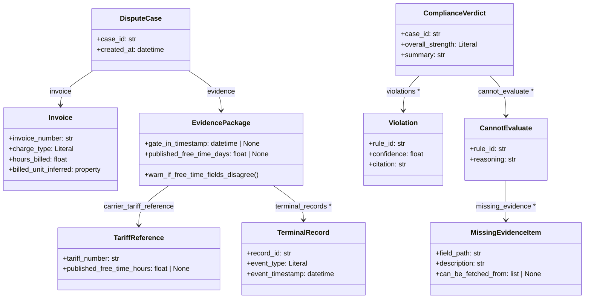

# data/schemas — DisputeOps ComplianceAuditor Schema Module

## What this module is

This module defines the immutable Pydantic v2 data contracts that flow into
and out of ComplianceAuditor, the FMC Part 541 rules engine in Stage 3 of the
DisputeOps case lifecycle.  `case.py` holds the **input** side — the structured
representation of a carrier invoice plus all evidence gathered by Stage 2
(PaperTrail / evidence-gathering agent).  `verdict.py` holds the **output**
side — the structured list of FMC violations, cannot-evaluate gaps, and overall
dispute strength that feed RecoveryOracle (probability scorer) and DemandSmith
(demand-letter drafter).  All models are frozen and use `extra="forbid"` where
downstream consumers are known, preventing silent field drift across agent
boundaries.

---

## Public model reference

| Model | File | One-line description |
|---|---|---|
| `DisputeCase` | `case.py` | Root input: case ID + invoice + evidence package |
| `Invoice` | `case.py` | Structured carrier invoice under audit |
| `EvidencePackage` | `case.py` | All Stage 2 evidence (gate times, TOS records, BOL, tariff) |
| `TariffReference` | `case.py` | Structured FMC-filed tariff reference used by R004 |
| `TerminalRecord` | `case.py` | A single event record from a terminal TOS export |
| `RuleResult` | `verdict.py` | Raw output of one rule function in `rules.py` |
| `Violation` | `verdict.py` | A confirmed FMC violation extracted from a `RuleResult` |
| `CannotEvaluate` | `verdict.py` | A rule skipped due to missing evidence, with structured gaps |
| `MissingEvidenceItem` | `verdict.py` | One structured evidence gap within a `CannotEvaluate` |
| `ComplianceVerdict` | `verdict.py` | Root output: aggregated violations + strength + summary |

---

## Deliberate scope decision — per-field provenance deferred to v2

We considered wrapping every evidence primitive in an `EvidenceField[T]`
generic that would carry `source`, `confidence`, and `retrieved_at` alongside
the value — mirroring how multi-source evidence aggregation works in
production freight TMS systems.  This was explicitly deferred to v2 because
(a) it would double the size of every schema, (b) Stage 2 currently has a
single extraction pipeline (PaperTrail) so there are no competing sources to
reconcile, and (c) the demo flow does not require provenance tracking.  The
decision is recorded in the `TODO (v2)` comment at the top of `case.py`.  When
Stage 2 gains parallel evidence sources that can disagree on the same field,
this is the first schema change to make.

---

## Model relationship diagram

---

## Key contracts with adjacent agents

| Contract | Detail |
|---|---|
| **PaperTrail → `Invoice.hours_billed`** | PaperTrail normalises daily-billed demurrage invoices to hours (`days × 24`) at extraction time.  ComplianceAuditor never sees raw days.  See `agents/paper_trail/README.md`. |
| **PaperTrail → `TariffReference.published_free_time_hours`** | Should equal `EvidencePackage.published_free_time_days × 24`.  `EvidencePackage` logs a `WARNING` when they differ by > 0.1 h — disagreement is an extraction-quality signal, not a fatal error. |
| **ComplianceAuditor → RecoveryOracle** | Consumes `ComplianceVerdict.violations` (with weights) and `cannot_evaluate` (discounted).  `MissingEvidenceItem.can_be_fetched_from` may be used for evidence-retry routing. |
| **ComplianceAuditor → DemandSmith** | Iterates `ComplianceVerdict.violations` only.  `cannot_evaluate` is ignored by DemandSmith. |
